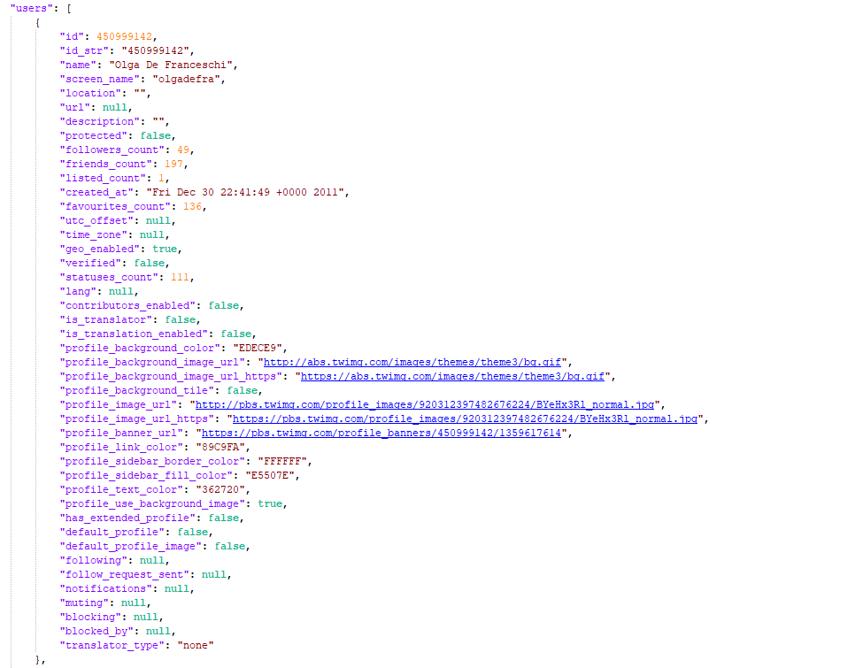
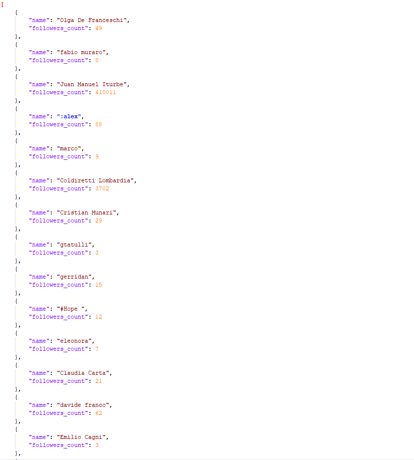
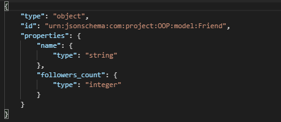
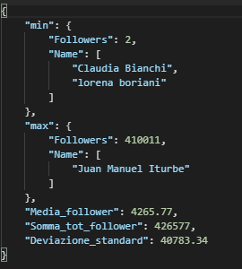
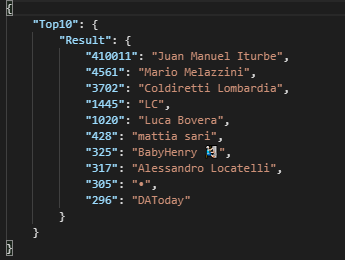

# Twitter Analytics 
## Foramato dei dati
In seguito ad una richiesta, l'applicazione scarica un JSON. Nel file è presente un vettore 'users' (in questo caso il vettore users sta ad indicare i friends delll'utente che stiamo andando ad analizzare). In questo vettore sono presenti i vari parametri che descrivono un utente di Twitter.
 

Una volta prese queste informazioni il programma andava ad effettuare un parsing dei dati in modo da ottenere solamente i parametri che servivano a noi ("name" e "followers_count").
 

In particolare:
* **name** rappresenta il nome dell'utente (friend)
* **followers_count** rappresenta il numero dei follower che quell'utente ha

## Rotte dell'applicazione
All'interno dell'applicazione è possibili andare ad effettuare quattro richieste GET(metodo che viene utilizzato principalmente per richiedere una risorsa al server) e una richiesta POST(nasce invece con l'idea di creare o modificare dei dati sul server).

