# Twitter Analytics 
## Foramato dei dati
In seguito ad una richiesta, l'applicazione scarica un JSON. Nel file è presente un vettore 'users' (in questo caso il vettore users sta ad indicare i friends delll'utente che stiamo andando ad analizzare). In questo vettore sono presenti i vari parametri che descrivono un utente di Twitter.
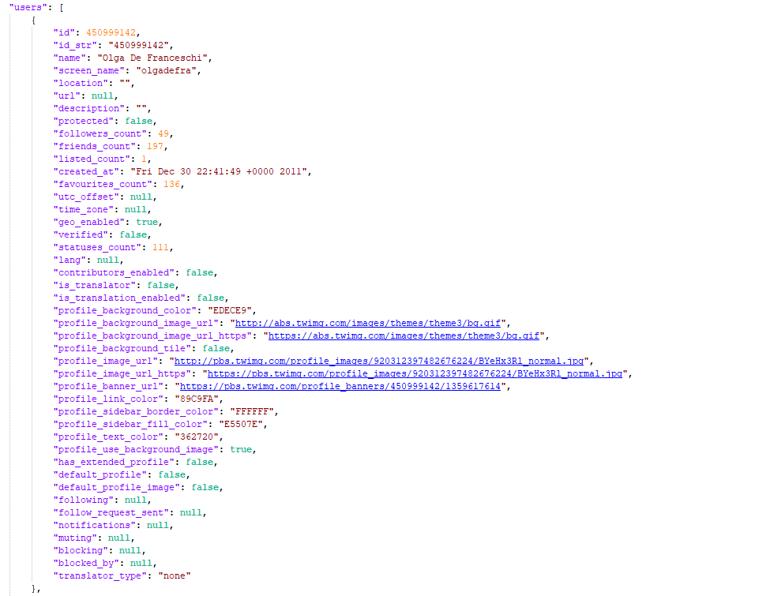 

Una volta prese queste informazioni il programma andava ad effettuare un parsing dei dati in modo da ottenere solamente i parametri che servivano a noi ("name" e "followers_count").
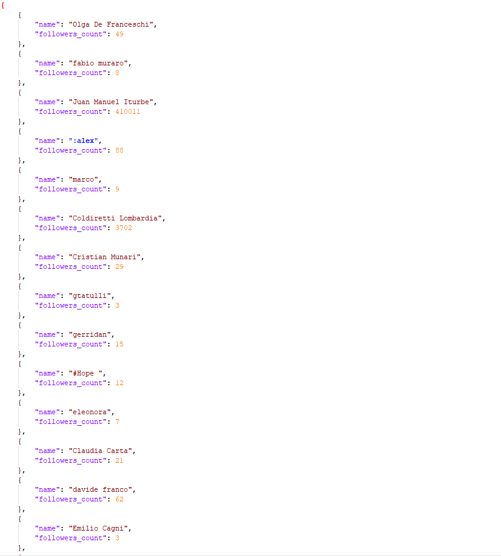 

In particolare:
* **name** rappresenta il nome dell'utente (friend)
* **followers_count** rappresenta il numero dei follower che quell'utente ha

## Rotte dell'applicazione
All'interno dell'applicazione è possibili andare ad effettuare quattro richieste GET(metodo che viene utilizzato principalmente per richiedere una risorsa al server) e una richiesta POST(nasce invece con l'idea di creare o modificare dei dati sul server).

La prima richiesta GET che andiamo a vedere è quella che permette di restituire tutti i dati parsati del file JSON.

  

Una rotta GET che siamo andati ad implementare è stata la seguente. Quest'ultima permette di ottenere i metadati presenti nel dataset. In particolare:
* **name** di tipo String
* **followers_count** di tipo Integer

  

  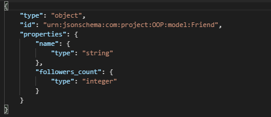

Le statistiche possono essere effettuate soltanto sul campo followers_count.

  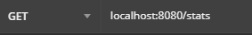

In questo caso le statistiche riguardano:
* **Min** indicano le persone che hanno il numero di follower più basso
* **Max** indicano le persone che hanno il numero di follower più alto
* **Media_follower** indica una media di tutti i follower presenti nella lista
* **Somma_tot_follower** indica la somma totate di tutti i follower 
* **Deviazione_standard** dà un’idea di come siano distribuiti i dati nel campione rispetto alla media. Detto in un altro modo, consente    di sapere se la media è affidabile per dare una rappresentazione significativa dei dati.

  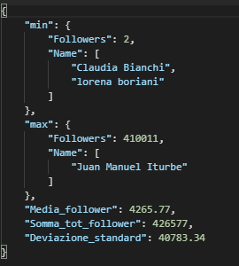

Con questa rotta l'utente può visualizzare una classifica dei primi 10 utenti che hanno più follower o ,viceversa, gli ultimi 10 utenti che hanno meno follower. Più precisamente, in questa rotta si deve specificare attraverso il campo field, che classifica si vuole andare a vedere. In caso di campo errato o nullo viene restituito un errore. 
<table class="center">
  <tr>
    <td>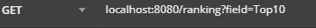</td>
    <td>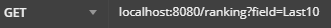</td>
  </tr>
    <tr>
    <td>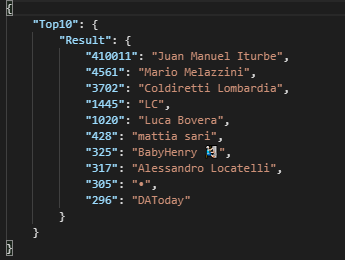</td>
    <td>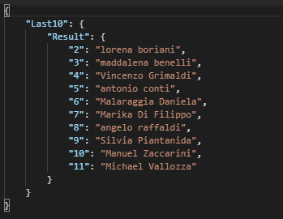</td>
  </tr>
 </table>
 
L'ultima rotta che analizziamo e una chiamata POST che permette di ottenere nome utente Twitter e numero di follower che rientrano su una fascia impostata dall'utente. Infatti, attraverso una RequestBody si può decidere su quale campo applicare il filtro e il filtro stesso. Ovviamente se si sbaglia a digitare il filtro o il campo, il programma restituirà un messaggio di errore. Qua sotto sono riportate immagini riguardanti un esempio di chiamata usando questa rotta ed esempi di filtro. Nel nostro caso siamo andati ad applicare i filtri solamente su un'unico campo, tuttavia se si vuole cambiare campo la logica rimane la stessa.  

  

**Esempi di filtri della rotta getBrackets** 

<table class="center">
  <tr>
    <td>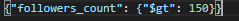</td>
  </tr>
  <tr>
    <td>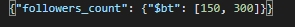</td>
  </tr>
  <tr>
    <td>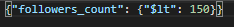</td> 
  </tr>
 </table>

 

## UML
## User Diagram
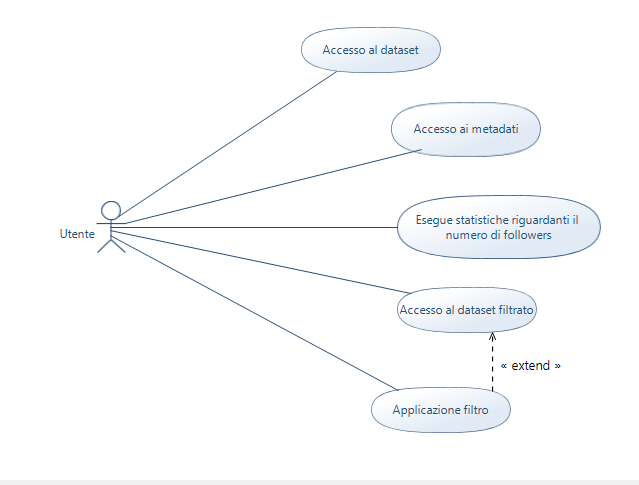
## Class Diagram
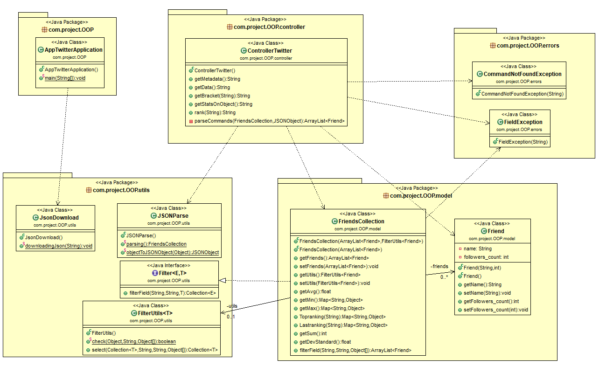 
## Sequence Diagram
* **GET/ranking**

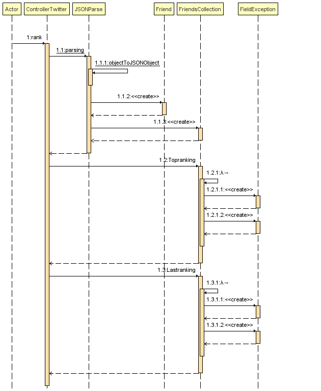 

* **GET/getStatsOnObject**

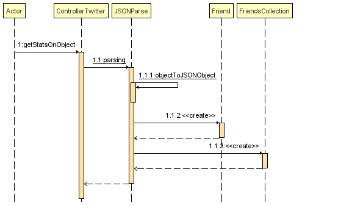 

* **GET/getData**

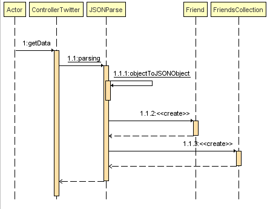 

* **POST/getBracket**

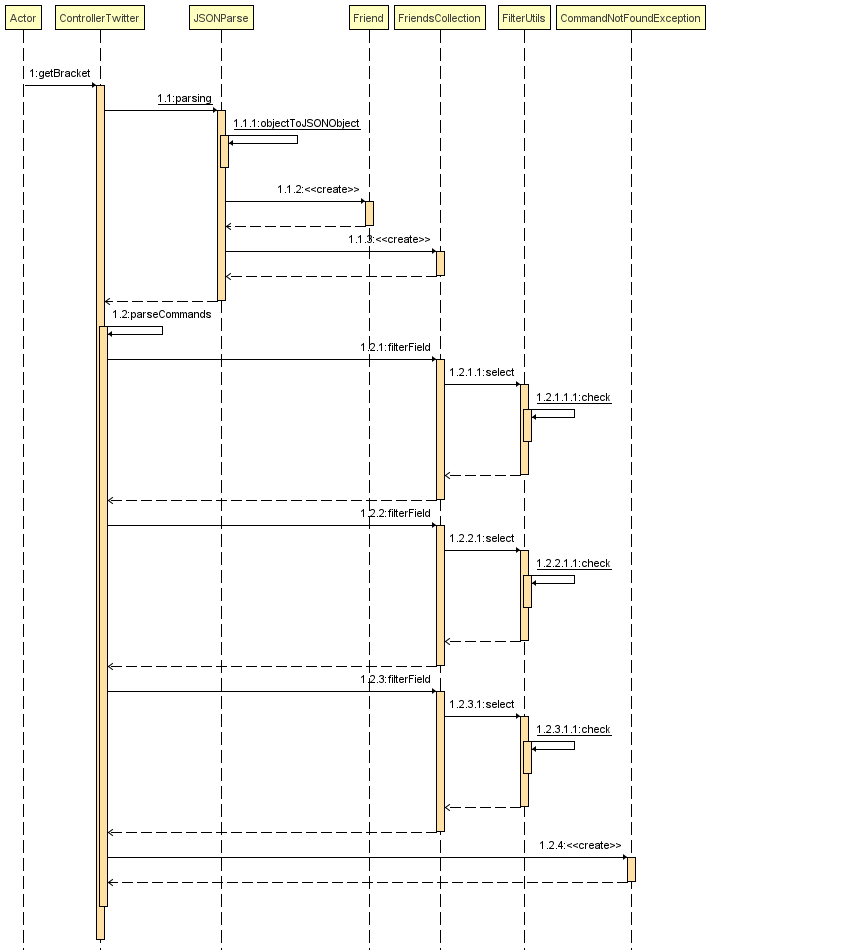
